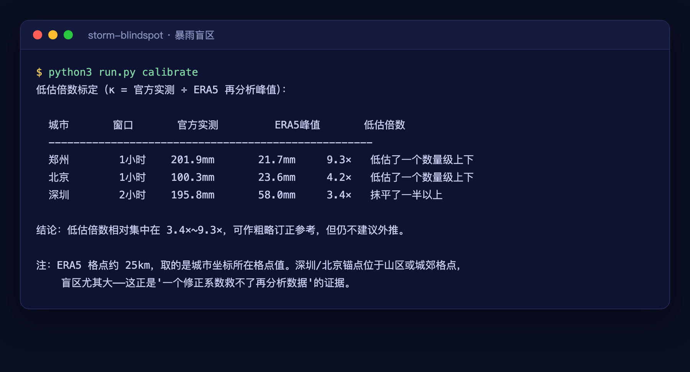

# storm-blindspot · 暴雨盲区

> 我们平时赖以感知风险的那套"权威降雨数据"，
> 到底把最凶的暴雨抹平了多少倍？

2021 年 7 月 20 日，郑州一小时下了 **201.9 毫米**，破了我国大陆气象观测的历史极值，淹了地铁 5 号线。

可如果你去查全球气候研究最常用的底料之一——ECMWF 的 **ERA5 再分析数据**——同一时刻、同一地点，它记录的那一小时只有约 **22 毫米**。

不是它坏了。ERA5 的分辨率约 25 公里，它把一个城市格点里的降雨做了空间平均，于是把最致命的那种"局地对流暴雨"给抹平了。**它低估了约 9 倍。**



这个盲区平时看不见，因为没人会拿它去比真实的极端事件。这个工具就是去比一比，把盲区**量出来**。

## 它发现了什么

用郑州、北京、深圳三座城市**有官方通报出处**的历史极值，去比 ERA5 在同点同时刻的峰值：

| 城市 | 官方实测 | ERA5 同场峰值 | 低估倍数 κ |
|---|---|---|---|
| 郑州 7·20（1h） | 201.9 mm | ~22 mm | **约 9.3×** |
| 北京 7·21（1h，平谷挂甲峪） | 100.3 mm | ~24 mm | **约 4.2×** |
| 深圳 9·7（2h） | 195.8 mm | ~58 mm | **约 3.4×** |

> 数字由 `python3 run.py calibrate` 现场联网重算（取"同一场雨、同一坐标"的 ERA5 滑窗峰值），可能随接口更新微调。

**再狠一点看**：把郑州 45 年的 ERA5 逐小时降雨拟合极值分布，它算出的"千年一遇小时雨强"约 **54 mm/h**。可 2021 年 7 月 20 日，郑州实测 **201.9 mm/h**——在 ERA5 的世界里，这场淹了地铁的雨是"千年一遇之外、几乎不可能发生"的。它比 ERA5 认定的"百年一遇"还高 5.2 倍。

**关键结论**：低估倍数从 3× 到 9× 不等，且事件越极端、地形越复杂，抹得越狠——**没有一个稳定的"订正系数"能把再分析数据修回真实**。盲区的宽度本身随地形和天气系统变化。你没法给它打个补丁，只能知道它在那儿。

## 快速上手

```bash
git clone https://github.com/wei011/storm-blindspot
cd storm-blindspot

python3 run.py calibrate            # 核心：三城实测 vs ERA5，量低估倍数
python3 run.py blindspot zhengzhou  # 拉郑州40年ERA5拟合"N年一遇"，对比实测看盲区
python3 run.py warn shenzhen        # 国标暴雨预警阈值翻译未来3天预报（绝对阈值，可信）
python3 run.py risk beijing         # 综合：降雨预警 + 上游河道流量 + 洼地指数
python3 run.py ls                   # 城市库
```

任意坐标都能体检：`python3 run.py blindspot --lat 30.6 --lon 114.3`。
任意子命令加 `--json` 输出结构化结果，方便喂给 agent 或接进流水线。

## 三条数据管线（全部真实、免费、无需 Key）

1. **ERA5 逐小时降雨**（open-meteo archive-api）：一座城市 40+ 年、几十万个小时的降雨，
   拟合 Gumbel 极值分布，反推"N 年一遇小时雨强"。
2. **GloFAS 河道流量预报**（flood-api）：上游河道未来 7 天的流量趋势，判断外洪风险。
3. **数字高程**（elevation api）：你脚下相对周边的下沉深度，算"洼地指数"。

极值统计与盲区标定的数学层**离线可测**：`python3 tests/selftest.py`。

## 为什么可信

- 三个标定锚点全部有官方出处（国务院灾害调查报告、中国气象局、深圳气象局），写在 `data/cities.json`，每条带来源链接。
- 排水设计重现期来自 **GB 50014-2021**《室外排水设计标准》表 4.1.3。
- 暴雨预警阈值来自中国气象局《气象灾害预警信号发布与传播办法》。
- 代码纯标准库，零第三方依赖，联网只调 open-meteo 免费开放接口。

## 它不是什么

- **不是对排水设计的指控**（2026-07 读者勘误，特此致谢）：中国排水设计的降雨底数
  **不用 ERA5**。GB 50014-2021 附录 A 要求设计降雨量采用当地**至少近 30 年日降水资料**
  （剔除 ≤2mm 降雨事件和全部降雪），附录 B 的暴雨强度公式采用**本地气象站自记雨量记录**——
  全部来自城市气象站实测。ERA5 的盲区污染不到设计院的图纸；它污染的是
  **公众风险感知、气候研究和缺乏站点资料地区的评估**——用公开网格数据判断
  "这里历史上下过多大雨"的你我。本仓库早期版本曾把 ERA5 表述为"水文规划的底料"，已修正。
- **不是官方预警的替代品**。真正的内涝还取决于本地管网、泵站、实时调度，这些它看不见。
- κ 不是逐点精确的订正系数——恰恰相反，工具的结论就是"别信单一订正系数"。
- 极值尾部外推在罕见事件上不确定性很大，仅供量级参考。

它替代不了官方预警。它替代的，是"我以为这里不会淹"的那种错觉。

## License

MIT © 2026 wei011
